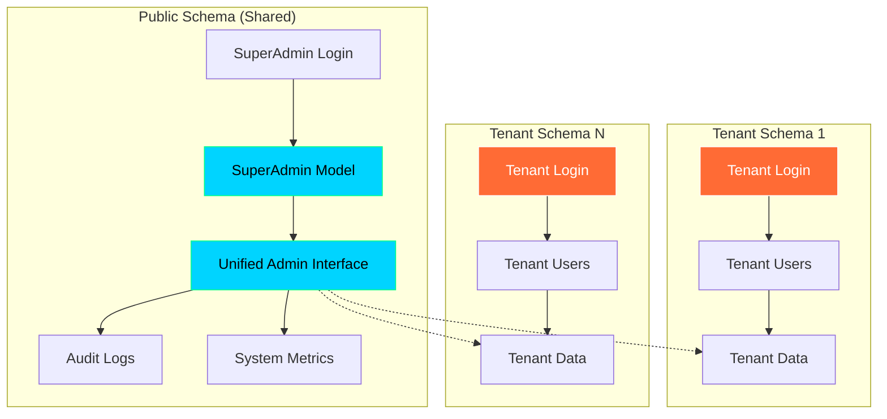
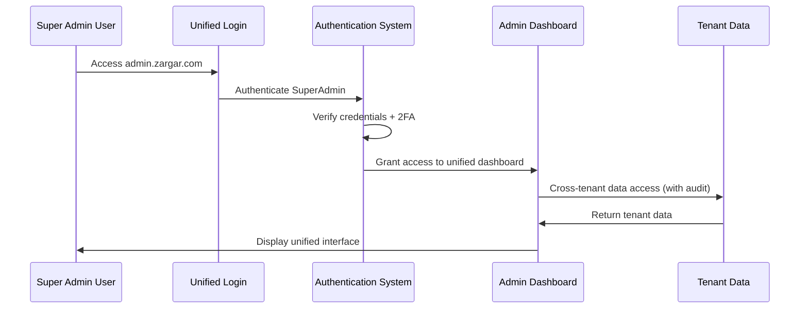

# Design Document

## Overview

This design document outlines the architecture and implementation approach for consolidating the ZARGAR jewelry SaaS platform's duplicate admin systems into a single, unified super admin interface. The solution will eliminate security risks, reduce maintenance overhead, and provide a comprehensive administrative experience while preserving the existing tenant login system and maintaining perfect tenant isolation.

## Architecture

### High-Level Architecture



### Authentication Flow



## Components and Interfaces

### 1. Unified Authentication System

#### SuperAdmin Authentication Backend
```python
class UnifiedSuperAdminBackend:
    """
    Single authentication backend for SuperAdmin users.
    Replaces multiple authentication flows.
    """
    
    def authenticate(self, request, username=None, password=None, **kwargs):
        # Authenticate against SuperAdmin model in public schema
        # Support 2FA verification
        # Log all authentication attempts
        pass
    
    def get_user(self, user_id):
        # Retrieve SuperAdmin user
        pass
```

#### Authentication Middleware
```python
class UnifiedAdminMiddleware:
    """
    Middleware to handle admin authentication and tenant switching.
    """
    
    def __call__(self, request):
        # Check if accessing admin URLs
        # Verify SuperAdmin authentication
        # Handle tenant context switching for cross-tenant access
        # Log all admin actions
        pass
```

### 2. Unified Admin Dashboard

#### Dashboard Architecture
```python
class UnifiedAdminDashboard:
    """
    Main dashboard component that aggregates all admin features.
    """
    
    sections = [
        'tenant_management',
        'user_impersonation', 
        'backup_recovery',
        'system_health',
        'billing_subscriptions',
        'security_audit',
        'disaster_recovery'
    ]
```

#### Navigation Structure
```
Unified Super Admin Dashboard
├── 🏠 Dashboard (Overview & Platform Metrics)
├── 🏢 Tenant Management
│   ├── Tenant List & Search
│   ├── Create New Tenant
│   ├── Tenant Statistics
│   └── Bulk Operations
├── 👥 User Impersonation & Management
│   ├── User Search & Impersonation
│   ├── Impersonation Audit Logs
│   ├── Active Sessions
│   └── Impersonation Statistics
├── 💾 Backup & Recovery
│   ├── Backup Management
│   ├── Backup History
│   ├── Backup Scheduling
│   ├── Tenant Restoration
│   └── Disaster Recovery
├── 📊 System Health & Monitoring
│   ├── System Health Dashboard
│   ├── Performance Metrics
│   ├── System Alerts
│   └── Health Reports
├── 💰 Billing & Subscriptions
│   ├── Subscription Plans
│   ├── Invoice Management
│   ├── Billing Cycles
│   └── Revenue Analytics
├── 🔒 Security & Audit
│   ├── Security Dashboard
│   ├── Audit Logs
│   ├── Security Events
│   └── Access Control
└── ⚙️ System Settings
    ├── Global Settings
    ├── Feature Toggles
    ├── Maintenance Mode
    └── System Configuration
```

### 3. Feature Integration Components

#### Tenant Management Component
```python
class TenantManagementComponent:
    """
    Comprehensive tenant management with all existing features.
    """
    
    features = [
        'tenant_crud_operations',
        'tenant_statistics',
        'tenant_search_filtering',
        'bulk_tenant_operations',
        'tenant_status_management'
    ]
```

#### User Impersonation Component
```python
class UserImpersonationComponent:
    """
    Django-hijack integration with comprehensive audit logging.
    """
    
    features = [
        'user_search_impersonation',
        'impersonation_audit_logs',
        'session_management',
        'impersonation_statistics',
        'security_controls'
    ]
```

#### Backup & Recovery Component
```python
class BackupRecoveryComponent:
    """
    Complete backup and disaster recovery management.
    """
    
    features = [
        'backup_management',
        'backup_scheduling',
        'tenant_restoration',
        'disaster_recovery',
        'backup_verification'
    ]
```

### 4. UI/UX Components

#### Theme System
```python
class UnifiedThemeSystem:
    """
    Dual theme support with cybersecurity and modern themes.
    """
    
    themes = {
        'light': {
            'primary_colors': ['#3B82F6', '#1E40AF'],
            'background': '#F9FAFB',
            'surface': '#FFFFFF',
            'text': '#111827'
        },
        'dark': {
            'primary_colors': ['#00D4FF', '#00FF88'],
            'background': '#0A0A0F',
            'surface': '#1A1A2E',
            'text': '#E2E8F0',
            'effects': ['glassmorphism', 'neon_glow']
        }
    }
```

#### Persian RTL Layout System
```python
class PersianLayoutSystem:
    """
    RTL layout system with Persian font support.
    """
    
    features = [
        'rtl_text_direction',
        'persian_font_rendering',
        'persian_number_formatting',
        'shamsi_calendar_integration',
        'persian_validation'
    ]
```

## Data Models

### Unified Admin Models

#### Consolidated SuperAdmin Model
```python
class SuperAdmin(AbstractUser):
    """
    Enhanced SuperAdmin model with all administrative capabilities.
    """
    
    # Persian information
    persian_first_name = models.CharField(max_length=150)
    persian_last_name = models.CharField(max_length=150)
    phone_number = models.CharField(max_length=15)
    
    # Security features
    is_2fa_enabled = models.BooleanField(default=False)
    theme_preference = models.CharField(max_length=10, default='light')
    
    # Administrative permissions
    can_create_tenants = models.BooleanField(default=True)
    can_suspend_tenants = models.BooleanField(default=True)
    can_access_all_data = models.BooleanField(default=True)
    can_impersonate_users = models.BooleanField(default=True)
    can_manage_backups = models.BooleanField(default=True)
    
    # Audit fields
    last_login_ip = models.GenericIPAddressField(null=True)
    last_tenant_access = models.DateTimeField(null=True)
    failed_login_attempts = models.PositiveIntegerField(default=0)
```

#### Comprehensive Audit Log Model
```python
class UnifiedAuditLog(models.Model):
    """
    Comprehensive audit logging for all admin actions.
    """
    
    # User information
    admin_user = models.ForeignKey(SuperAdmin, on_delete=models.CASCADE)
    
    # Action details
    action_type = models.CharField(max_length=50)
    target_model = models.CharField(max_length=100)
    target_object_id = models.CharField(max_length=100)
    
    # Tenant context
    tenant_schema = models.CharField(max_length=100)
    
    # Request information
    ip_address = models.GenericIPAddressField()
    user_agent = models.TextField()
    request_path = models.CharField(max_length=500)
    
    # Timing and status
    timestamp = models.DateTimeField(auto_now_add=True)
    success = models.BooleanField(default=True)
    error_message = models.TextField(blank=True)
    
    # Additional context
    details = models.JSONField(default=dict)
```

### Session Management Models

#### Unified Session Model
```python
class UnifiedAdminSession(models.Model):
    """
    Track all admin sessions across tenants.
    """
    
    admin_user = models.ForeignKey(SuperAdmin, on_delete=models.CASCADE)
    session_key = models.CharField(max_length=40, unique=True)
    
    # Session metadata
    ip_address = models.GenericIPAddressField()
    user_agent = models.TextField()
    created_at = models.DateTimeField(auto_now_add=True)
    last_activity = models.DateTimeField(auto_now=True)
    
    # Tenant access tracking
    accessed_tenants = models.JSONField(default=list)
    current_tenant_schema = models.CharField(max_length=100, blank=True)
    
    # Session status
    is_active = models.BooleanField(default=True)
    ended_at = models.DateTimeField(null=True)
```

## Error Handling

### Authentication Error Handling
```python
class UnifiedAuthenticationErrorHandler:
    """
    Centralized error handling for authentication issues.
    """
    
    error_types = [
        'invalid_credentials',
        'account_locked',
        '2fa_required',
        '2fa_invalid',
        'session_expired',
        'insufficient_permissions'
    ]
    
    def handle_error(self, error_type, request, **context):
        # Log security event
        # Display appropriate Persian error message
        # Implement rate limiting
        # Redirect to appropriate page
        pass
```

### Data Access Error Handling
```python
class TenantDataAccessErrorHandler:
    """
    Handle errors when accessing tenant data.
    """
    
    def handle_tenant_access_error(self, tenant_schema, error):
        # Log access attempt
        # Check permissions
        # Provide fallback behavior
        # Notify administrators if needed
        pass
```

## Testing Strategy

### Comprehensive Test Coverage

#### Authentication Tests
```python
class UnifiedAuthenticationTests:
    """
    Test all authentication scenarios.
    """
    
    test_cases = [
        'valid_superadmin_login',
        'invalid_credentials',
        '2fa_verification',
        'session_management',
        'permission_checks',
        'rate_limiting',
        'security_logging'
    ]
```

#### Feature Integration Tests
```python
class FeatureIntegrationTests:
    """
    Test all admin features work correctly.
    """
    
    test_areas = [
        'tenant_management_workflows',
        'user_impersonation_flows',
        'backup_recovery_operations',
        'system_health_monitoring',
        'billing_subscription_management',
        'security_audit_features'
    ]
```

#### Playwright End-to-End Tests
```python
class PlaywrightAdminTests:
    """
    Comprehensive browser-based testing.
    """
    
    test_scenarios = [
        'complete_login_workflow',
        'dashboard_navigation',
        'tenant_management_ui',
        'impersonation_workflows',
        'backup_management_ui',
        'theme_switching',
        'persian_rtl_layout',
        'responsive_design'
    ]
```

### Security Testing
```python
class SecurityTests:
    """
    Comprehensive security testing.
    """
    
    security_checks = [
        'unauthorized_access_prevention',
        'tenant_isolation_verification',
        'session_security',
        'csrf_protection',
        'sql_injection_prevention',
        'xss_protection',
        'audit_log_integrity'
    ]
```

## Migration Strategy

### Phase 1: Preparation
1. **Backup Current System**
   - Full database backup
   - Code repository backup
   - Configuration backup

2. **Create Unified Models**
   - Implement new unified models
   - Create migration scripts
   - Test data migration

### Phase 2: Implementation
1. **Build Unified Interface**
   - Implement unified dashboard
   - Integrate all existing features
   - Apply consistent styling

2. **Authentication Consolidation**
   - Implement unified authentication
   - Remove duplicate auth flows
   - Update URL routing

### Phase 3: Testing & Validation
1. **Comprehensive Testing**
   - Run all automated tests
   - Perform manual testing
   - Security validation

2. **Data Migration**
   - Migrate existing admin data
   - Verify data integrity
   - Clean up obsolete data

### Phase 4: Deployment & Cleanup
1. **Deploy Unified System**
   - Deploy to production
   - Monitor system performance
   - Verify all features work

2. **Remove Legacy Code**
   - Delete duplicate admin files
   - Remove obsolete URLs
   - Clean up database

## Performance Considerations

### Optimization Strategies
1. **Database Optimization**
   - Efficient queries for cross-tenant data
   - Proper indexing for audit logs
   - Connection pooling optimization

2. **Caching Strategy**
   - Cache frequently accessed data
   - Redis caching for session data
   - Template fragment caching

3. **Frontend Optimization**
   - Lazy loading for large datasets
   - Efficient JavaScript bundling
   - Image optimization

### Scalability Planning
1. **Horizontal Scaling**
   - Load balancer configuration
   - Session sharing across instances
   - Database read replicas

2. **Monitoring & Alerting**
   - Performance monitoring
   - Error rate tracking
   - Resource usage alerts

## Security Architecture

### Access Control
```python
class UnifiedAccessControl:
    """
    Comprehensive access control system.
    """
    
    permission_levels = [
        'super_admin_full_access',
        'tenant_data_access',
        'system_monitoring_access',
        'backup_management_access',
        'user_impersonation_access'
    ]
```

### Audit & Compliance
```python
class ComplianceSystem:
    """
    Ensure compliance with security standards.
    """
    
    compliance_features = [
        'comprehensive_audit_logging',
        'data_access_tracking',
        'session_monitoring',
        'security_event_logging',
        'gdpr_compliance_tools'
    ]
```

This design provides a comprehensive foundation for implementing the unified super admin system while maintaining security, performance, and user experience standards.