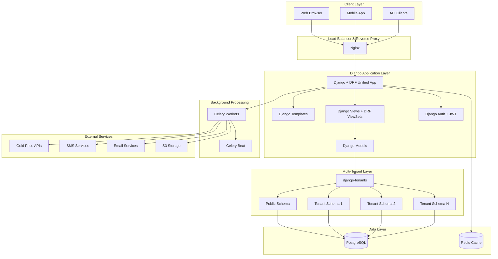

# Design Document

## Overview

ZARGAR is a comprehensive multi-tenant SaaS platform built as a unified Django application with Django REST Framework integration. The system follows a Persian-native, RTL-first design philosophy, utilizing Django's built-in features extensively to minimize complexity while maximizing security and maintainability. The architecture leverages django-tenants for complete data isolation, Django Templates for server-side rendering, and modern UI technologies for an exceptional user experience.

## Architecture

### High-Level Architecture



### Unified Architecture Benefits

The system implements a single Django application that handles both web UI and API endpoints, providing:

- **Shared Authentication System**: Single authentication mechanism across web interface and API
- **Consistent Data Models**: Same business logic for both web and mobile access
- **Simplified Deployment**: One application stack reduces complexity
- **Django Built-in Features**: Leverages Django's admin, authentication, and session management
- **No API-Frontend Synchronization**: Eliminates complex state management issues

### Multi-Tenant Architecture

**Schema-Based Isolation**: Using django-tenants library with shared database, separate schemas approach:

- **Public Schema**: Contains shared data (tenant configurations, admin users, system settings)
- **Tenant Schemas**: Each jewelry shop gets isolated schema with complete data separation
- **Automatic Routing**: Subdomain-based tenant resolution (shop1.zargar.com, shop2.zargar.com)
- **Security**: Complete data isolation prevents cross-tenant data access

## Components and Interfaces

### Core Django Components

#### 1. Authentication & Authorization System

**Django Built-in Authentication Integration**:
```python
# Custom User Model extending AbstractUser
class User(AbstractUser):
    tenant = models.ForeignKey(Tenant, on_delete=CASCADE, null=True)
    role = models.CharField(max_length=20, choices=ROLE_CHOICES)
    phone_number = models.CharField(max_length=15)
    is_2fa_enabled = models.BooleanField(default=False)
    theme_preference = models.CharField(max_length=10, default='light')
    
# DRF Token Authentication + JWT
class CustomTokenAuthentication(TokenAuthentication):
    # Custom token handling with tenant context
    
# 2FA Integration
class TOTPDevice(models.Model):
    user = models.OneToOneField(User, on_delete=CASCADE)
    secret_key = models.CharField(max_length=32)
    is_confirmed = models.BooleanField(default=False)
```

**Role-Based Access Control**:
- **Owner**: Full access to all tenant features
- **Accountant**: Access to accounting, reporting, customer management
- **Salesperson**: Access to POS, inventory, customer lookup

#### 2. Multi-Tenant Models Architecture

**Tenant-Aware Base Model**:
```python
class TenantAwareModel(models.Model):
    created_at = models.DateTimeField(auto_now_add=True)
    updated_at = models.DateTimeField(auto_now=True)
    created_by = models.ForeignKey(User, on_delete=SET_NULL, null=True)
    
    class Meta:
        abstract = True

# Core Business Models
class Customer(TenantAwareModel):
    name = models.CharField(max_length=100)
    phone = models.CharField(max_length=15)
    address = models.TextField()
    birth_date = models.DateField(null=True)
    loyalty_points = models.IntegerField(default=0)

class JewelryItem(TenantAwareModel):
    name = models.CharField(max_length=200)
    category = models.ForeignKey(Category, on_delete=CASCADE)
    weight_grams = models.DecimalField(max_digits=8, decimal_places=3)
    karat = models.IntegerField()  # عیار
    manufacturing_cost = models.DecimalField(max_digits=10, decimal_places=2)  # اجرت
    sku = models.CharField(max_length=50, unique=True)
    barcode = models.CharField(max_length=100, unique=True)
    
class GoldInstallment(TenantAwareModel):
    customer = models.ForeignKey(Customer, on_delete=CASCADE)
    initial_gold_weight = models.DecimalField(max_digits=8, decimal_places=3)
    remaining_gold_weight = models.DecimalField(max_digits=8, decimal_places=3)
    payment_schedule = models.CharField(max_length=20)  # weekly, bi-weekly, monthly
    contract_date = models.DateField()
    status = models.CharField(max_length=20, default='active')
```

#### 3. Persian Localization System

**Django i18n Integration**:
```python
# settings.py
LANGUAGE_CODE = 'fa'
USE_I18N = True
USE_L10N = True
USE_TZ = True
LOCALE_PATHS = [BASE_DIR / 'locale']

# Custom Persian Calendar Integration
class PersianDateField(models.DateField):
    def to_python(self, value):
        # Convert between Shamsi and Gregorian calendars
        
class PersianNumberFormatter:
    @staticmethod
    def format_currency(amount):
        # Format in Toman with Persian numerals (۱۲۳۴۵۶۷۸۹۰)
        
    @staticmethod
    def format_weight(grams):
        # Convert to مثقال، سوت display
```

**Dual Theme System**:

**Light Mode - Modern Enterprise Design**:
```html
<!-- Light Mode Base Template -->
<!DOCTYPE html>
<html dir="rtl" lang="fa">
<head>
    <meta charset="UTF-8">
    <title>زرگر</title>
    <link href="" rel="stylesheet">
    <script src=""></script>
    <script src=""></script>
</head>
<body class="bg-gray-50 text-gray-900" x-data="{ darkMode: localStorage.getItem('theme') === 'dark' }">
    <!-- Modern Light Theme -->
</body>
</html>
```

**Dark Mode - Cybersecurity Theme**:
```html
<!-- Dark Mode Cybersecurity Template -->
<!DOCTYPE html>
<html dir="rtl" lang="fa">
<head>
    <meta charset="UTF-8">
    <title>زرگر</title>
    <link href="" rel="stylesheet">
    <link href="" rel="stylesheet">
    <script src=""></script>
    <script src=""></script>
    <script src=""></script>
</head>
<body class="cyber-bg-primary cyber-text-primary" x-data="{ darkMode: localStorage.getItem('theme') === 'dark' }">
    <!-- Cybersecurity Theme with Glassmorphism -->
    <div class="cyber-glass-base">
        <!-- Theme Toggle with Neon Effects -->
        <div x-data="cyberThemeToggle()">
            <button @click="toggleTheme()" class="cyber-neon-button">
                <span x-show="!darkMode" class="cyber-icon-moon"></span>
                <span x-show="darkMode" class="cyber-icon-sun"></span>
            </button>
        </div>
    </div>
</body>
</html>
```

**Cybersecurity Theme CSS Integration**:
```css
/* Core Cybersecurity Color Palette */
:root {
  --cyber-bg-primary: #0B0E1A;
  --cyber-bg-secondary: #1A1D29;
  --cyber-bg-surface: #252A3A;
  --cyber-neon-primary: #00D4FF;
  --cyber-neon-secondary: #00FF88;
  --cyber-neon-tertiary: #FF6B35;
  --cyber-text-primary: #FFFFFF;
  --cyber-text-secondary: #B8BCC8;
}

.cyber-bg-primary { background-color: var(--cyber-bg-primary); }
.cyber-text-primary { color: var(--cyber-text-primary); }

.cyber-glass-base {
  backdrop-filter: blur(20px) saturate(180%);
  background: linear-gradient(145deg, rgba(255,255,255,0.03) 0%, rgba(255,255,255,0.01) 100%);
  border: 1px solid rgba(255, 255, 255, 0.06);
  box-shadow: 0 8px 32px rgba(0, 0, 0, 0.4), inset 0 1px 0 rgba(255, 255, 255, 0.05);
}

.cyber-neon-button {
  background: linear-gradient(145deg, rgba(0,212,255,0.08) 0%, rgba(0,255,136,0.04) 100%);
  border: 1px solid rgba(0, 212, 255, 0.2);
  box-shadow: 0 8px 32px rgba(0, 212, 255, 0.15), 0 0 20px rgba(0, 212, 255, 0.1);
  transition: all 0.3s ease;
}

.cyber-neon-button:hover {
  transform: scale(1.05);
  box-shadow: 0 12px 40px rgba(0, 212, 255, 0.25), 0 0 30px rgba(0, 212, 255, 0.2);
}
```

### Cybersecurity Theme System (Dark Mode)

#### Theme Architecture Integration

**Cybersecurity Color Palette** (Applied to both Admin and Tenant Dark Mode):
```typescript
interface CyberSecurityPalette {
  background: {
    primary: '#0B0E1A',      // Deep dark blue-black
    secondary: '#1A1D29',    // Slightly lighter dark blue
    surface: '#252A3A',      // Card surface color
    elevated: '#2D3348',     // Elevated elements
    glass: 'rgba(255, 255, 255, 0.03)', // Glassmorphism
    gradient: {
      primary: 'linear-gradient(135deg, #0B0E1A 0%, #1A1D29 50%, #252A3A 100%)',
      card: 'linear-gradient(145deg, rgba(255,255,255,0.05) 0%, rgba(255,255,255,0.02) 100%)',
      neon: 'linear-gradient(90deg, #00D4FF 0%, #00FF88 50%, #FF6B35 100%)',
    }
  };
  neon: {
    primary: '#00D4FF',      // Bright cyan
    secondary: '#00FF88',    // Bright green
    tertiary: '#FF6B35',     // Orange accent
    warning: '#FFB800',      // Golden yellow
    danger: '#FF4757',       // Bright red
    success: '#00FF88',      // Bright green
    purple: '#A55EEA',       // Purple accent
  };
  text: {
    primary: '#FFFFFF',      // Pure white for main text
    secondary: '#B8BCC8',    // Light gray for secondary text
    muted: '#6B7280',        // Muted gray
    neon: '#00D4FF',         // Glowing cyan for highlights
    numbers: '#00FF88',      // Matrix green for numbers/stats
  };
}
```

**Glassmorphism Effects for Both Admin and Tenant**:
```css
.glass-card-jewelry {
  backdrop-filter: blur(16px) saturate(150%);
  background: linear-gradient(145deg, 
    rgba(37, 42, 58, 0.8) 0%, 
    rgba(26, 29, 41, 0.9) 50%,
    rgba(11, 14, 26, 0.95) 100%);
  border: 1px solid rgba(255, 255, 255, 0.04);
  box-shadow: 0 12px 40px rgba(0, 0, 0, 0.6), inset 0 1px 0 rgba(255, 255, 255, 0.03);
}

.neon-border-gradient {
  border-image: linear-gradient(90deg, #00D4FF, #00FF88, #FF6B35) 1;
  animation: neon-pulse 2s ease-in-out infinite alternate;
}

@keyframes neon-pulse {
  from { box-shadow: 0 0 20px rgba(0, 212, 255, 0.1); }
  to { box-shadow: 0 0 30px rgba(0, 212, 255, 0.3), 0 0 60px rgba(0, 255, 136, 0.1); }
}
```

**Admin Dashboard Cybersecurity Components**:
```python
class CyberAdminDashboard(TemplateView):
    template_name = 'admin/cyber_dashboard.html'
    
    def get_context_data(self, **kwargs):
        context = super().get_context_data(**kwargs)
        context['theme_mode'] = 'cybersecurity'
        context['neon_colors'] = {
            'primary': '#00D4FF',
            'secondary': '#00FF88', 
            'tertiary': '#FF6B35'
        }
        context['glass_effects'] = True
        context['animations_enabled'] = True
        return context
```

**Tenant Portal Cybersecurity Components**:
```python
class CyberTenantDashboard(LoginRequiredMixin, TenantContextMixin, TemplateView):
    template_name = 'tenant/cyber_dashboard.html'
    
    def get_context_data(self, **kwargs):
        context = super().get_context_data(**kwargs)
        context['theme_mode'] = 'cybersecurity'
        context['jewelry_metrics'] = get_jewelry_metrics_with_cyber_styling()
        context['gold_price_widget'] = get_cyber_gold_price_widget()
        return context
```

**Framer Motion Integration for Animations**:
```javascript
// Cybersecurity theme animations for both admin and tenant
const cyberAnimations = {
  cardEntrance: {
    initial: { opacity: 0, y: 20, scale: 0.95 },
    animate: { opacity: 1, y: 0, scale: 1 },
    transition: { duration: 0.4, ease: [0.4, 0, 0.2, 1] }
  },
  neonGlow: {
    animate: {
      boxShadow: [
        '0 0 20px rgba(0, 212, 255, 0.1)',
        '0 0 30px rgba(0, 212, 255, 0.3), 0 0 60px rgba(0, 255, 136, 0.1)',
        '0 0 20px rgba(0, 212, 255, 0.1)'
      ]
    },
    transition: { duration: 2, repeat: Infinity }
  }
};
```

### API Layer Design

#### DRF Integration Within Django App

**Unified ViewSets**:
```python
class JewelryItemViewSet(viewsets.ModelViewSet):
    serializer_class = JewelryItemSerializer
    permission_classes = [IsAuthenticated, TenantPermission]
    
    def get_queryset(self):
        # Automatic tenant filtering
        return JewelryItem.objects.filter(tenant=self.request.tenant)
    
    @action(detail=True, methods=['post'])
    def generate_barcode(self, request, pk=None):
        # Generate QR code for jewelry item
        
class GoldInstallmentViewSet(viewsets.ModelViewSet):
    serializer_class = GoldInstallmentSerializer
    
    @action(detail=True, methods=['post'])
    def process_payment(self, request, pk=None):
        # Convert cash payment to gold weight reduction
        current_gold_price = get_current_gold_price()
        # Business logic for payment processing
```

**API Authentication Strategy**:
```python
# JWT + Token Authentication
class TenantAwareJWTAuthentication(JWTAuthentication):
    def authenticate(self, request):
        # Extract tenant from subdomain
        # Validate JWT token with tenant context
        
# API Rate Limiting
class TenantRateThrottle(UserRateThrottle):
    scope = 'tenant_api'
    
    def get_cache_key(self, request, view):
        # Rate limiting per tenant
```

### Admin Super-Panel Components

#### 1. Tenant Management System

**Complete CRUD Operations**:
```python
class TenantManagementView(SuperAdminRequiredMixin, TemplateView):
    template_name = 'admin/tenant_management.html'
    
    def get_context_data(self, **kwargs):
        context = super().get_context_data(**kwargs)
        context['tenants'] = Tenant.objects.all().select_related('owner')
        context['subscription_plans'] = SubscriptionPlan.objects.all()
        return context

class TenantCreateView(SuperAdminRequiredMixin, CreateView):
    model = Tenant
    fields = ['name', 'domain_url', 'subscription_plan', 'owner_email']
    
    def form_valid(self, form):
        # Automated tenant provisioning
        tenant = form.save()
        
        # Create schema
        tenant.create_schema()
        
        # Setup subdomain
        setup_subdomain(tenant.domain_url)
        
        # Create initial owner user
        create_tenant_owner(tenant, form.cleaned_data['owner_email'])
        
        # Send welcome email
        send_tenant_welcome_email(tenant)
        
        return super().form_valid(form)

class TenantSuspendView(SuperAdminRequiredMixin, View):
    def post(self, request, tenant_id):
        tenant = get_object_or_404(Tenant, id=tenant_id)
        tenant.is_active = False
        tenant.save()
        
        # Log suspension
        AuditLog.objects.create(
            action='tenant_suspended',
            tenant=tenant,
            admin_user=request.user,
            details=f"Tenant {tenant.name} suspended by {request.user.username}"
        )
        
        return JsonResponse({'status': 'success'})
```

#### 2. Subscription & Billing Management

**Iranian Market Adaptation**:
```python
class SubscriptionPlan(models.Model):
    name = models.CharField(max_length=100)  # Basic, Pro, Enterprise
    name_persian = models.CharField(max_length=100)
    monthly_price_toman = models.DecimalField(max_digits=10, decimal_places=2)
    max_users = models.IntegerField()
    max_inventory_items = models.IntegerField()
    features = models.JSONField()  # List of included features
    
class TenantInvoice(models.Model):
    tenant = models.ForeignKey(Tenant, on_delete=CASCADE)
    invoice_number = models.CharField(max_length=50, unique=True)
    issue_date_shamsi = models.DateField()
    due_date_shamsi = models.DateField()
    amount_toman = models.DecimalField(max_digits=12, decimal_places=2)
    status = models.CharField(max_length=20)  # pending, paid, overdue
    payment_method = models.CharField(max_length=50)  # bank_transfer, cash, cheque
    
class BillingManagementView(SuperAdminRequiredMixin, TemplateView):
    def generate_monthly_invoices(self):
        # Generate invoices for all active tenants
        for tenant in Tenant.objects.filter(is_active=True):
            invoice = TenantInvoice.objects.create(
                tenant=tenant,
                invoice_number=generate_invoice_number(),
                issue_date_shamsi=get_current_shamsi_date(),
                due_date_shamsi=get_current_shamsi_date() + timedelta(days=30),
                amount_toman=tenant.subscription_plan.monthly_price_toman
            )
            
            # Send invoice via email/SMS
            send_invoice_notification(tenant, invoice)
```

#### 3. Secure Admin Impersonation System

**Complete Impersonation Workflow**:
```python
class AdminImpersonationView(SuperAdminRequiredMixin, View):
    def post(self, request):
        target_user_id = request.POST.get('user_id')
        target_user = get_object_or_404(User, id=target_user_id)
        
        # Security check - only super admins
        if not request.user.is_superuser:
            raise PermissionDenied("Only super admins can impersonate users")
        
        # Create impersonation session
        impersonation_session = ImpersonationSession.objects.create(
            admin_user=request.user,
            target_user=target_user,
            tenant=target_user.tenant,
            start_time=timezone.now(),
            ip_address=get_client_ip(request),
            user_agent=request.META.get('HTTP_USER_AGENT', '')
        )
        
        # Log in as target user
        login(request, target_user, backend='django.contrib.auth.backends.ModelBackend')
        
        # Set impersonation flag in session
        request.session['impersonating'] = {
            'session_id': impersonation_session.id,
            'admin_user_id': request.user.id,
            'admin_username': request.user.username,
            'start_time': timezone.now().isoformat()
        }
        
        # Redirect to tenant dashboard
        return redirect(f"https://{target_user.tenant.domain_url}/dashboard/")

class ExitImpersonationView(View):
    def post(self, request):
        if 'impersonating' not in request.session:
            return JsonResponse({'error': 'Not in impersonation session'})
        
        # End impersonation session
        session_id = request.session['impersonating']['session_id']
        impersonation_session = ImpersonationSession.objects.get(id=session_id)
        impersonation_session.end_time = timezone.now()
        impersonation_session.save()
        
        # Clear session
        del request.session['impersonating']
        logout(request)
        
        # Redirect back to admin panel
        return redirect('/admin/dashboard/')

# Impersonation Banner Middleware
class ImpersonationBannerMiddleware:
    def __init__(self, get_response):
        self.get_response = get_response
        
    def __call__(self, request):
        response = self.get_response(request)
        
        if 'impersonating' in request.session:
            # Inject impersonation banner into HTML response
            if response.get('Content-Type', '').startswith('text/html'):
                banner_html = render_to_string('admin/impersonation_banner.html', {
                    'admin_username': request.session['impersonating']['admin_username'],
                    'start_time': request.session['impersonating']['start_time']
                })
                
                # Insert banner after <body> tag
                content = response.content.decode('utf-8')
                content = content.replace('<body>', f'<body>{banner_html}')
                response.content = content.encode('utf-8')
                
        return response
```

#### 4. System Health Dashboard

**Real-time Monitoring**:
```python
class SystemHealthDashboard(SuperAdminRequiredMixin, TemplateView):
    template_name = 'admin/system_health.html'
    
    def get_context_data(self, **kwargs):
        context = super().get_context_data(**kwargs)
        
        # Database health
        context['database_status'] = check_database_health()
        context['slow_queries'] = get_slow_queries()
        
        # Redis health
        context['redis_status'] = check_redis_health()
        context['cache_hit_rate'] = get_cache_hit_rate()
        
        # Celery workers
        context['celery_workers'] = get_celery_worker_status()
        context['failed_tasks'] = get_failed_celery_tasks()
        
        # System metrics
        context['cpu_usage'] = get_cpu_usage()
        context['memory_usage'] = get_memory_usage()
        context['disk_usage'] = get_disk_usage()
        
        # Tenant statistics
        context['total_tenants'] = Tenant.objects.count()
        context['active_tenants'] = Tenant.objects.filter(is_active=True).count()
        context['recent_signups'] = Tenant.objects.filter(
            created_at__gte=timezone.now() - timedelta(days=7)
        ).count()
        
        return context

def check_database_health():
    try:
        with connection.cursor() as cursor:
            cursor.execute("SELECT 1")
            return {'status': 'healthy', 'response_time': measure_query_time()}
    except Exception as e:
        return {'status': 'error', 'error': str(e)}

def get_celery_worker_status():
    from celery import current_app
    inspect = current_app.control.inspect()
    
    stats = inspect.stats()
    active = inspect.active()
    
    return {
        'workers': stats,
        'active_tasks': active,
        'total_workers': len(stats) if stats else 0
    }
```

### Tenant Portal Components

#### 1. Enhanced Dashboard & Reporting

**Persian Business Intelligence**:
```python
class TenantDashboardView(LoginRequiredMixin, TenantContextMixin, TemplateView):
    template_name = 'tenant/dashboard.html'
    
    def get_context_data(self, **kwargs):
        context = super().get_context_data(**kwargs)
        tenant = self.request.tenant
        
        # Key metrics
        context['today_sales'] = get_today_sales(tenant)
        context['monthly_sales'] = get_monthly_sales(tenant)
        context['inventory_value'] = calculate_inventory_value(tenant)
        context['low_stock_items'] = get_low_stock_items(tenant)
        
        # Gold price integration
        context['current_gold_price'] = get_current_iranian_gold_price()
        context['gold_price_trend'] = get_gold_price_trend(days=30)
        
        # Customer insights
        context['top_customers'] = get_top_customers(tenant)
        context['pending_installments'] = get_pending_installments(tenant)
        
        # Persian calendar integration
        context['shamsi_date'] = get_current_shamsi_date()
        context['upcoming_holidays'] = get_upcoming_persian_holidays()
        
        return context

class ComprehensiveReportingEngine(LoginRequiredMixin, TenantContextMixin, View):
    def generate_financial_report(self, report_type, date_range):
        """Generate Persian financial reports"""
        tenant = self.request.tenant
        
        if report_type == 'trial_balance':
            return generate_trial_balance(tenant, date_range)
        elif report_type == 'profit_loss':
            return generate_profit_loss_statement(tenant, date_range)
        elif report_type == 'balance_sheet':
            return generate_balance_sheet(tenant, date_range)
        elif report_type == 'inventory_valuation':
            return generate_inventory_valuation_report(tenant, date_range)
        elif report_type == 'customer_aging':
            return generate_customer_aging_report(tenant, date_range)
            
    def export_report(self, report_data, format_type):
        """Export reports in multiple formats"""
        if format_type == 'pdf':
            return generate_persian_pdf_report(report_data)
        elif format_type == 'excel':
            return generate_excel_report(report_data)
        elif format_type == 'csv':
            return generate_csv_report(report_data)
```

#### 2. Advanced Customer Experience & Marketing

**Persian Cultural Integration**:
```python
class CustomerLoyaltyProgram(TenantContextMixin, models.Model):
    tenant = models.ForeignKey(Tenant, on_delete=CASCADE)
    name_persian = models.CharField(max_length=100)
    points_per_toman = models.DecimalField(max_digits=5, decimal_places=2)
    vip_threshold = models.IntegerField()
    birthday_bonus_points = models.IntegerField()
    anniversary_bonus_points = models.IntegerField()
    
class CustomerEngagementSystem:
    @staticmethod
    def send_birthday_reminders(tenant):
        """Send Persian birthday wishes with gift suggestions"""
        today_shamsi = get_current_shamsi_date()
        birthday_customers = Customer.objects.filter(
            tenant=tenant,
            birth_date_shamsi__month=today_shamsi.month,
            birth_date_shamsi__day=today_shamsi.day
        )
        
        for customer in birthday_customers:
            # Generate personalized gift suggestions
            suggestions = generate_gift_suggestions(customer)
            
            # Send Persian SMS/Email
            send_birthday_message(customer, suggestions)
            
            # Award bonus points
            award_loyalty_points(customer, 'birthday_bonus')
    
    @staticmethod
    def manage_layaway_plans(customer, jewelry_item, payment_terms):
        """Traditional Persian layaway system"""
        layaway_plan = LayawayPlan.objects.create(
            customer=customer,
            jewelry_item=jewelry_item,
            total_amount=jewelry_item.price,
            down_payment=payment_terms['down_payment'],
            monthly_payment=payment_terms['monthly_payment'],
            duration_months=payment_terms['duration'],
            start_date_shamsi=get_current_shamsi_date()
        )
        
        # Generate Persian contract
        contract = generate_layaway_contract(layaway_plan)
        
        # Setup payment reminders
        schedule_payment_reminders(layaway_plan)
        
        return layaway_plan

class PushNotificationSystem:
    @staticmethod
    def send_appointment_reminders(tenant):
        """Send Persian appointment reminders"""
        tomorrow_shamsi = get_current_shamsi_date() + timedelta(days=1)
        appointments = Appointment.objects.filter(
            tenant=tenant,
            appointment_date_shamsi=tomorrow_shamsi
        )
        
        for appointment in appointments:
            message = f"یادآوری: فردا قرار ملاقات شما در ساعت {appointment.time} می‌باشد."
            send_push_notification(appointment.customer, message)
```

### Storage Configuration

#### Cloudflare R2 and Backblaze B2 Integration

**Environment Configuration**:
```python
# settings.py - Storage Configuration
import os

# Cloudflare R2 Configuration
CLOUDFLARE_R2_ACCESS_KEY = os.getenv('CLOUDFLARE_R2_ACCESS_KEY', '3f3dfdd35d139a687d4d00d75da96c76')
CLOUDFLARE_R2_SECRET_KEY = os.getenv('CLOUDFLARE_R2_SECRET_KEY', '2999aa7307448cadfebe63cce0e55f6f74726edfcc32e5de8881015a31c4c897')
CLOUDFLARE_R2_BUCKET = os.getenv('CLOUDFLARE_R2_BUCKET', 'securesyntax')
CLOUDFLARE_R2_ENDPOINT = os.getenv('CLOUDFLARE_R2_ENDPOINT', 'https://b7900eeee7c415345d86ea859c9dad47.r2.cloudflarestorage.com')
CLOUDFLARE_R2_ACCOUNT_ID = os.getenv('CLOUDFLARE_R2_ACCOUNT_ID', 'b7900eeee7c415345d86ea859c9dad47')

# Backblaze B2 Configuration
BACKBLAZE_B2_ACCESS_KEY = os.getenv('BACKBLAZE_B2_ACCESS_KEY', '005acba9882c2b80000000001')
BACKBLAZE_B2_SECRET_KEY = os.getenv('BACKBLAZE_B2_SECRET_KEY', 'K005LzPhrovqG5Eq37oYWxIQiIKIHh8')
BACKBLAZE_B2_BUCKET = os.getenv('BACKBLAZE_B2_BUCKET', 'securesyntax')

# Storage backends
STORAGES = {
    "default": {
        "BACKEND": "django.core.files.storage.FileSystemStorage",
    },
    "staticfiles": {
        "BACKEND": "django.contrib.staticfiles.storage.StaticFilesStorage",
    },
    "backup_primary": {
        "BACKEND": "storages.backends.s3boto3.S3Boto3Storage",
        "OPTIONS": {
            "access_key": CLOUDFLARE_R2_ACCESS_KEY,
            "secret_key": CLOUDFLARE_R2_SECRET_KEY,
            "bucket_name": CLOUDFLARE_R2_BUCKET,
            "endpoint_url": CLOUDFLARE_R2_ENDPOINT,
            "region_name": "auto",
        },
    },
    "backup_secondary": {
        "BACKEND": "storages.backends.s3boto3.S3Boto3Storage",
        "OPTIONS": {
            "access_key": BACKBLAZE_B2_ACCESS_KEY,
            "secret_key": BACKBLAZE_B2_SECRET_KEY,
            "bucket_name": BACKBLAZE_B2_BUCKET,
            "endpoint_url": "https://s3.us-west-002.backblazeb2.com",
            "region_name": "us-west-002",
        },
    },
}
```

**Backup Storage Implementation**:
```python
class RedundantBackupStorage:
    def __init__(self):
        self.primary_storage = get_storage('backup_primary')  # Cloudflare R2
        self.secondary_storage = get_storage('backup_secondary')  # Backblaze B2
        
    def upload_backup(self, backup_file_path, backup_filename):
        """Upload backup to both R2 and B2 for redundancy"""
        success_primary = False
        success_secondary = False
        
        try:
            # Upload to Cloudflare R2
            with open(backup_file_path, 'rb') as f:
                self.primary_storage.save(f"backups/{backup_filename}", f)
            success_primary = True
            logger.info(f"Backup uploaded to Cloudflare R2: {backup_filename}")
            
        except Exception as e:
            logger.error(f"Failed to upload to Cloudflare R2: {str(e)}")
            
        try:
            # Upload to Backblaze B2
            with open(backup_file_path, 'rb') as f:
                self.secondary_storage.save(f"backups/{backup_filename}", f)
            success_secondary = True
            logger.info(f"Backup uploaded to Backblaze B2: {backup_filename}")
            
        except Exception as e:
            logger.error(f"Failed to upload to Backblaze B2: {str(e)}")
            
        if not (success_primary or success_secondary):
            raise BackupUploadError("Failed to upload backup to any storage provider")
            
        return {
            'primary_success': success_primary,
            'secondary_success': success_secondary,
            'backup_filename': backup_filename
        }
    
    def download_backup(self, backup_filename):
        """Download backup from available storage"""
        try:
            # Try Cloudflare R2 first
            return self.primary_storage.open(f"backups/{backup_filename}")
        except Exception as e:
            logger.warning(f"Failed to download from R2, trying B2: {str(e)}")
            
        try:
            # Fallback to Backblaze B2
            return self.secondary_storage.open(f"backups/{backup_filename}")
        except Exception as e:
            logger.error(f"Failed to download from both storages: {str(e)}")
            raise BackupDownloadError("Backup file not available from any storage provider")

# Docker Environment File (.env)
CLOUDFLARE_R2_ACCESS_KEY=3f3dfdd35d139a687d4d00d75da96c76
CLOUDFLARE_R2_SECRET_KEY=2999aa7307448cadfebe63cce0e55f6f74726edfcc32e5de8881015a31c4c897
CLOUDFLARE_R2_BUCKET=securesyntax
CLOUDFLARE_R2_ENDPOINT=https://b7900eeee7c415345d86ea859c9dad47.r2.cloudflarestorage.com
CLOUDFLARE_R2_ACCOUNT_ID=b7900eeee7c415345d86ea859c9dad47

BACKBLAZE_B2_ACCESS_KEY=005acba9882c2b80000000001
BACKBLAZE_B2_SECRET_KEY=K005LzPhrovqG5Eq37oYWxIQiIKIHh8
BACKBLAZE_B2_BUCKET=securesyntax
```

### Background Processing Architecture

#### Celery Integration

**Task Categories**:
```python
# Gold Price Updates
@shared_task
def update_gold_prices():
    # Fetch from Iranian gold market APIs
    # Update all tenant calculations
    
# Backup Tasks
@shared_task
def create_tenant_backup(tenant_id):
    # Create encrypted pg_dump for specific tenant
    # Upload to Cloudflare R2/Backblaze B2
    
# Notification Tasks
@shared_task
def send_payment_reminders():
    # Send SMS/email reminders for overdue payments
    
# Report Generation
@shared_task
def generate_financial_report(tenant_id, report_type, date_range):
    # Generate Persian accounting reports
    # Cache results in Redis
```

**Celery Configuration**:
```python
# celery.py
CELERY_BEAT_SCHEDULE = {
    'update-gold-prices': {
        'task': 'core.tasks.update_gold_prices',
        'schedule': crontab(minute='*/15'),  # Every 15 minutes
    },
    'daily-backups': {
        'task': 'core.tasks.create_daily_backup',
        'schedule': crontab(hour=3, minute=0),  # 3 AM daily
    },
    'payment-reminders': {
        'task': 'core.tasks.send_payment_reminders',
        'schedule': crontab(hour=9, minute=0),  # 9 AM daily
    },
}
```

## Data Models

### Core Business Models

#### Persian Accounting System

```python
class ChartOfAccounts(TenantAwareModel):
    """کدینگ حسابداری"""
    code = models.CharField(max_length=20, unique=True)
    name_persian = models.CharField(max_length=200)
    account_type = models.CharField(max_length=50)
    parent = models.ForeignKey('self', null=True, blank=True, on_delete=CASCADE)
    
class JournalEntry(TenantAwareModel):
    """ثبت اسناد حسابداری"""
    entry_number = models.CharField(max_length=50, unique=True)
    date_shamsi = models.DateField()
    description = models.TextField()
    total_debit = models.DecimalField(max_digits=15, decimal_places=2)
    total_credit = models.DecimalField(max_digits=15, decimal_places=2)
    
class GeneralLedger(TenantAwareModel):
    """دفتر کل"""
    account = models.ForeignKey(ChartOfAccounts, on_delete=CASCADE)
    journal_entry = models.ForeignKey(JournalEntry, on_delete=CASCADE)
    debit_amount = models.DecimalField(max_digits=15, decimal_places=2, default=0)
    credit_amount = models.DecimalField(max_digits=15, decimal_places=2, default=0)
    
class ChequeManagement(TenantAwareModel):
    """مدیریت چک ها"""
    cheque_number = models.CharField(max_length=50)
    bank_name = models.CharField(max_length=100)
    amount = models.DecimalField(max_digits=15, decimal_places=2)
    issue_date = models.DateField()
    due_date = models.DateField()
    status = models.CharField(max_length=20)  # issued, received, cashed, bounced
    customer = models.ForeignKey(Customer, on_delete=CASCADE, null=True)
```

#### Gold Installment System

```python
class GoldInstallmentContract(TenantAwareModel):
    """سیستم طلای قرضی"""
    contract_number = models.CharField(max_length=50, unique=True)
    customer = models.ForeignKey(Customer, on_delete=CASCADE)
    initial_gold_weight_grams = models.DecimalField(max_digits=8, decimal_places=3)
    remaining_gold_weight_grams = models.DecimalField(max_digits=8, decimal_places=3)
    initial_gold_price_per_gram = models.DecimalField(max_digits=10, decimal_places=2)
    payment_frequency = models.CharField(max_length=20)  # weekly, bi-weekly, monthly
    number_of_payments = models.IntegerField()
    contract_date_shamsi = models.DateField()
    price_protection_ceiling = models.DecimalField(max_digits=10, decimal_places=2, null=True)
    price_protection_floor = models.DecimalField(max_digits=10, decimal_places=2, null=True)
    early_payment_discount_percent = models.DecimalField(max_digits=5, decimal_places=2, default=0)
    
class GoldInstallmentPayment(TenantAwareModel):
    contract = models.ForeignKey(GoldInstallmentContract, on_delete=CASCADE)
    payment_date_shamsi = models.DateField()
    cash_amount_toman = models.DecimalField(max_digits=15, decimal_places=2)
    gold_price_per_gram_at_payment = models.DecimalField(max_digits=10, decimal_places=2)
    gold_weight_reduction_grams = models.DecimalField(max_digits=8, decimal_places=3)
    remaining_balance_after_payment = models.DecimalField(max_digits=8, decimal_places=3)
    payment_type = models.CharField(max_length=20)  # regular, overpayment, adjustment
    notes = models.TextField(blank=True)
    
class GoldWeightAdjustment(TenantAwareModel):
    """Manual gold weight adjustments with audit trail"""
    contract = models.ForeignKey(GoldInstallmentContract, on_delete=CASCADE)
    adjustment_date = models.DateField()
    weight_change_grams = models.DecimalField(max_digits=8, decimal_places=3)  # Can be negative
    reason = models.CharField(max_length=200)
    adjusted_by = models.ForeignKey(User, on_delete=SET_NULL, null=True)
    audit_notes = models.TextField()
```

#### Advanced Inventory Management

```python
class ProductCategory(TenantAwareModel):
    name_persian = models.CharField(max_length=100)
    name_english = models.CharField(max_length=100)
    parent = models.ForeignKey('self', null=True, blank=True, on_delete=CASCADE)
    
class Gemstone(TenantAwareModel):
    name = models.CharField(max_length=100)
    type = models.CharField(max_length=50)  # diamond, emerald, ruby, etc.
    carat_weight = models.DecimalField(max_digits=6, decimal_places=3)
    cut_grade = models.CharField(max_length=50)
    color_grade = models.CharField(max_length=10)
    clarity_grade = models.CharField(max_length=10)
    certification_number = models.CharField(max_length=100)
    certification_authority = models.CharField(max_length=100)
    
class JewelryItemPhoto(TenantAwareModel):
    jewelry_item = models.ForeignKey(JewelryItem, on_delete=CASCADE, related_name='photos')
    image = models.ImageField(upload_to='jewelry_photos/')
    caption = models.CharField(max_length=200, blank=True)
    is_primary = models.BooleanField(default=False)
    angle = models.CharField(max_length=50)  # front, back, side, detail
    
class Supplier(TenantAwareModel):
    name = models.CharField(max_length=200)
    contact_person = models.CharField(max_length=100)
    phone = models.CharField(max_length=15)
    address = models.TextField()
    payment_terms = models.CharField(max_length=100)
    
class PurchaseOrder(TenantAwareModel):
    supplier = models.ForeignKey(Supplier, on_delete=CASCADE)
    order_number = models.CharField(max_length=50, unique=True)
    order_date = models.DateField()
    expected_delivery_date = models.DateField()
    total_amount = models.DecimalField(max_digits=15, decimal_places=2)
    status = models.CharField(max_length=20)  # pending, confirmed, delivered, cancelled
```

## Error Handling

### Comprehensive Error Management

#### Django Error Handling

```python
# Custom Exception Classes
class TenantAccessDeniedError(PermissionDenied):
    """Raised when user tries to access another tenant's data"""
    
class GoldPriceUnavailableError(Exception):
    """Raised when gold price API is unavailable"""
    
class InvalidPaymentAmountError(ValidationError):
    """Raised when payment amount is invalid for gold installment"""

# Global Exception Handler
class GlobalExceptionMiddleware:
    def __init__(self, get_response):
        self.get_response = get_response
        
    def __call__(self, request):
        try:
            response = self.get_response(request)
        except TenantAccessDeniedError:
            # Log security violation
            # Return appropriate error response
        except GoldPriceUnavailableError:
            # Use cached gold price
            # Notify administrators
        return response

# API Error Responses
class CustomAPIExceptionHandler:
    def custom_exception_handler(exc, context):
        response = exception_handler(exc, context)
        
        if response is not None:
            custom_response_data = {
                'error': True,
                'message_persian': get_persian_error_message(exc),
                'message_english': str(exc),
                'error_code': get_error_code(exc),
                'timestamp': timezone.now().isoformat(),
            }
            response.data = custom_response_data
            
        return response
```

#### Backup & Recovery Error Handling

```python
class BackupManager:
    @staticmethod
    def create_tenant_backup(tenant_id):
        try:
            # Create pg_dump with specific schema
            backup_file = f"tenant_{tenant_id}_{timezone.now().strftime('%Y%m%d_%H%M%S')}.sql"
            
            # Execute pg_dump command
            result = subprocess.run([
                'pg_dump',
                '--schema=tenant_' + str(tenant_id),
                '--no-owner',
                '--no-privileges',
                DATABASE_URL
            ], capture_output=True, text=True)
            
            if result.returncode != 0:
                raise BackupCreationError(f"pg_dump failed: {result.stderr}")
                
            # Encrypt backup file
            encrypted_backup = encrypt_file(backup_file)
            
            # Upload to S3-compatible storage
            upload_to_storage(encrypted_backup, 'cloudflare-r2')
            upload_to_storage(encrypted_backup, 'backblaze-b2')  # Redundant storage
            
        except Exception as e:
            logger.error(f"Backup creation failed for tenant {tenant_id}: {str(e)}")
            # Send alert to administrators
            send_admin_alert(f"Backup failed for tenant {tenant_id}")
            raise
            
    @staticmethod
    def restore_tenant_from_backup(tenant_id, backup_date):
        try:
            # Download backup from storage
            backup_file = download_from_storage(f"tenant_{tenant_id}_{backup_date}.sql")
            
            # Decrypt backup file
            decrypted_backup = decrypt_file(backup_file)
            
            # Create temporary snapshot before restoration
            create_temp_snapshot(tenant_id)
            
            # Execute pg_restore
            result = subprocess.run([
                'pg_restore',
                '--schema=tenant_' + str(tenant_id),
                '--clean',
                '--if-exists',
                decrypted_backup
            ], capture_output=True, text=True)
            
            if result.returncode != 0:
                # Restore from temporary snapshot
                restore_from_temp_snapshot(tenant_id)
                raise RestoreError(f"pg_restore failed: {result.stderr}")
                
        except Exception as e:
            logger.error(f"Restore failed for tenant {tenant_id}: {str(e)}")
            raise
```

## Testing Strategy

### Multi-Layered Testing Approach

#### Unit Testing with pytest

```python
# conftest.py
@pytest.fixture
def tenant_user(db):
    """Create a test user within a tenant context"""
    tenant = Tenant.objects.create(
        domain_url='test-shop.zargar.com',
        schema_name='test_shop',
        name='Test Jewelry Shop'
    )
    
    with tenant_context(tenant):
        user = User.objects.create_user(
            username='testuser',
            password='testpass123',
            role='owner'
        )
    return user, tenant

# Test Cases
class TestGoldInstallmentSystem:
    def test_payment_processing(self, tenant_user):
        user, tenant = tenant_user
        
        with tenant_context(tenant):
            # Create gold installment contract
            contract = GoldInstallmentContract.objects.create(
                customer=Customer.objects.create(name='Test Customer'),
                initial_gold_weight_grams=Decimal('10.000'),
                remaining_gold_weight_grams=Decimal('10.000'),
                payment_frequency='monthly'
            )
            
            # Process payment
            payment_amount = Decimal('5000000')  # 5 million Toman
            current_gold_price = Decimal('2500000')  # 2.5 million per gram
            
            payment = process_installment_payment(
                contract, payment_amount, current_gold_price
            )
            
            # Assertions
            expected_weight_reduction = payment_amount / current_gold_price
            assert payment.gold_weight_reduction_grams == expected_weight_reduction
            assert contract.remaining_gold_weight_grams == Decimal('8.000')

class TestPersianLocalization:
    def test_shamsi_calendar_conversion(self):
        # Test Shamsi to Gregorian conversion
        shamsi_date = '1403/06/28'  # Persian date
        gregorian_date = convert_shamsi_to_gregorian(shamsi_date)
        assert gregorian_date.year == 2024
        
    def test_persian_number_formatting(self):
        amount = Decimal('1234567.89')
        formatted = format_persian_currency(amount)
        assert '۱٬۲۳۴٬۵۶۷' in formatted
        assert 'تومان' in formatted
```

#### Integration Testing

```python
class TestMultiTenantIntegration:
    def test_tenant_data_isolation(self):
        # Create two tenants
        tenant1 = create_test_tenant('shop1')
        tenant2 = create_test_tenant('shop2')
        
        # Create data in each tenant
        with tenant_context(tenant1):
            customer1 = Customer.objects.create(name='Customer 1')
            
        with tenant_context(tenant2):
            customer2 = Customer.objects.create(name='Customer 2')
            
        # Verify isolation
        with tenant_context(tenant1):
            assert Customer.objects.count() == 1
            assert Customer.objects.first().name == 'Customer 1'
            
        with tenant_context(tenant2):
            assert Customer.objects.count() == 1
            assert Customer.objects.first().name == 'Customer 2'

class TestAPIIntegration:
    def test_drf_authentication(self, api_client, tenant_user):
        user, tenant = tenant_user
        
        # Test JWT token authentication
        token = generate_jwt_token(user, tenant)
        api_client.credentials(HTTP_AUTHORIZATION=f'Bearer {token}')
        
        response = api_client.get('/api/jewelry-items/')
        assert response.status_code == 200
        
    def test_api_rate_limiting(self, api_client, tenant_user):
        user, tenant = tenant_user
        token = generate_jwt_token(user, tenant)
        api_client.credentials(HTTP_AUTHORIZATION=f'Bearer {token}')
        
        # Make multiple requests to test rate limiting
        for i in range(100):
            response = api_client.get('/api/jewelry-items/')
            if response.status_code == 429:  # Too Many Requests
                break
        else:
            pytest.fail("Rate limiting not working")
```

#### Performance Testing

```python
class TestPerformance:
    def test_database_query_performance(self, django_assert_num_queries):
        # Test that complex queries stay within performance limits
        with django_assert_num_queries(5):  # Maximum 5 queries
            # Load dashboard data
            dashboard_data = get_dashboard_data(tenant_id=1)
            
    def test_gold_price_update_performance(self):
        # Test bulk gold price updates
        start_time = time.time()
        update_all_tenant_gold_prices()
        end_time = time.time()
        
        # Should complete within 30 seconds for 500 tenants
        assert (end_time - start_time) < 30
        
    def test_backup_creation_performance(self):
        # Test backup creation time
        start_time = time.time()
        create_tenant_backup(tenant_id=1)
        end_time = time.time()
        
        # Should complete within 5 minutes for typical tenant
        assert (end_time - start_time) < 300
```

#### 3. Modern Business Operations Integration

**Offline-First POS System**:
```python
class OfflinePOSSystem:
    def __init__(self):
        self.local_storage = LocalStorageManager()
        self.sync_queue = SyncQueue()
        
    def process_offline_sale(self, sale_data):
        """Process sales when internet is unavailable"""
        # Store locally with timestamp
        offline_sale = {
            'id': generate_offline_id(),
            'timestamp': timezone.now().isoformat(),
            'customer_id': sale_data['customer_id'],
            'items': sale_data['items'],
            'total_amount': sale_data['total_amount'],
            'payment_method': sale_data['payment_method'],
            'status': 'pending_sync'
        }
        
        self.local_storage.save_sale(offline_sale)
        self.sync_queue.add(offline_sale)
        
        return offline_sale
    
    def sync_offline_data(self):
        """Sync offline data when connection restored"""
        pending_sales = self.sync_queue.get_pending()
        
        for sale in pending_sales:
            try:
                # Sync to server
                server_sale = self.upload_sale_to_server(sale)
                
                # Update local status
                sale['status'] = 'synced'
                sale['server_id'] = server_sale.id
                self.local_storage.update_sale(sale)
                
                # Remove from sync queue
                self.sync_queue.remove(sale['id'])
                
            except Exception as e:
                logger.error(f"Failed to sync sale {sale['id']}: {str(e)}")

class TouchOptimizedInterface:
    """Large buttons and clear displays for jewelry shop counters"""
    
    @staticmethod
    def render_pos_interface():
        return {
            'button_size': 'large',  # Minimum 44px touch targets
            'font_size': 'xl',       # Large text for easy reading
            'contrast': 'high',      # High contrast for jewelry shop lighting
            'rtl_layout': True,      # Persian RTL layout
            'quick_actions': [
                'add_item', 'customer_lookup', 'apply_discount',
                'gold_price_check', 'installment_calculator'
            ]
        }

class CloudSynchronization:
    def __init__(self):
        self.sync_manager = SyncManager()
        
    def auto_sync_data(self):
        """Automatic data sync across all devices"""
        sync_data = {
            'inventory_updates': get_pending_inventory_updates(),
            'customer_changes': get_pending_customer_changes(),
            'sales_data': get_pending_sales_data(),
            'gold_prices': get_latest_gold_prices()
        }
        
        # Sync to all tenant devices
        for device in get_tenant_devices():
            self.sync_manager.push_updates(device, sync_data)
            
    def handle_conflict_resolution(self, conflicts):
        """Resolve data conflicts between devices"""
        for conflict in conflicts:
            if conflict['type'] == 'inventory_count':
                # Use most recent timestamp
                resolved_data = max(conflict['versions'], key=lambda x: x['timestamp'])
            elif conflict['type'] == 'customer_data':
                # Merge non-conflicting fields
                resolved_data = merge_customer_data(conflict['versions'])
            
            self.sync_manager.apply_resolution(conflict['id'], resolved_data)
```

**Data Export & Business Continuity**:
```python
class BusinessContinuityManager:
    def __init__(self, tenant):
        self.tenant = tenant
        
    def create_local_backup(self):
        """Create local backup for business continuity"""
        backup_data = {
            'customers': list(Customer.objects.filter(tenant=self.tenant).values()),
            'inventory': list(JewelryItem.objects.filter(tenant=self.tenant).values()),
            'sales': list(Sale.objects.filter(tenant=self.tenant).values()),
            'installments': list(GoldInstallmentContract.objects.filter(tenant=self.tenant).values()),
            'accounting': list(JournalEntry.objects.filter(tenant=self.tenant).values()),
            'backup_timestamp': timezone.now().isoformat(),
            'tenant_info': {
                'name': self.tenant.name,
                'domain': self.tenant.domain_url,
                'schema': self.tenant.schema_name
            }
        }
        
        # Encrypt backup data
        encrypted_backup = encrypt_data(backup_data)
        
        # Save to multiple formats
        formats = ['json', 'csv', 'excel']
        backup_files = {}
        
        for format_type in formats:
            filename = f"backup_{self.tenant.schema_name}_{timezone.now().strftime('%Y%m%d_%H%M%S')}.{format_type}"
            
            if format_type == 'json':
                backup_files[format_type] = save_json_backup(encrypted_backup, filename)
            elif format_type == 'csv':
                backup_files[format_type] = save_csv_backup(backup_data, filename)
            elif format_type == 'excel':
                backup_files[format_type] = save_excel_backup(backup_data, filename)
                
        return backup_files
    
    def quick_restore_capability(self, backup_file):
        """Quick restoration for business continuity"""
        try:
            # Decrypt and validate backup
            backup_data = decrypt_and_validate_backup(backup_file)
            
            # Create restoration point
            restoration_point = create_restoration_point(self.tenant)
            
            # Restore data
            with transaction.atomic():
                restore_customers(backup_data['customers'])
                restore_inventory(backup_data['inventory'])
                restore_sales(backup_data['sales'])
                restore_installments(backup_data['installments'])
                restore_accounting(backup_data['accounting'])
                
            return {
                'status': 'success',
                'restoration_point': restoration_point.id,
                'restored_records': count_restored_records(backup_data)
            }
            
        except Exception as e:
            # Rollback to restoration point
            rollback_to_restoration_point(restoration_point)
            raise RestoreError(f"Restoration failed: {str(e)}")
```

This comprehensive design document now provides the complete technical foundation for implementing the ZARGAR jewelry SaaS platform, including:

✅ **Complete Admin Super-Panel Features**: Tenant CRUD, subscription billing, secure impersonation, system health monitoring
✅ **Full Tenant Portal Components**: Enhanced dashboard, comprehensive reporting, customer engagement, loyalty programs
✅ **Modern Business Operations**: Offline POS, touch-optimized interface, cloud synchronization, business continuity
✅ **Storage Configuration**: Specific Cloudflare R2 and Backblaze B2 credentials and implementation
✅ **Persian Cultural Integration**: Shamsi calendar, Persian numerals, Iranian business practices
✅ **Complete Architecture**: Django unified stack, multi-tenant isolation, security, and testing strategies

The design ensures all requirements from both instruction.md and requirements.md are addressed with proper technical implementation details.